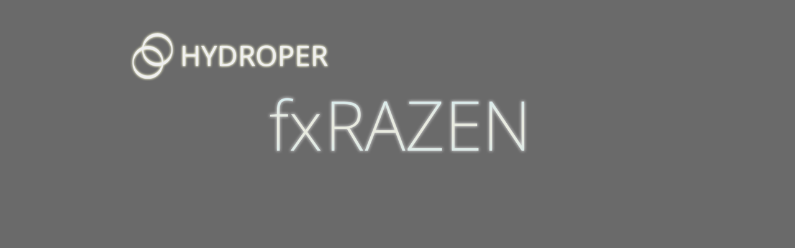

  

FXRazen is an ActionScript 3 compiler under development, for use with the Adobe AIR technology. It will compile a dialect of MXML supporting a new component set.

The FXRazen infrastructure is implemented in Rust.

## Research

## License

Apache 2.0, copyright © Hydroper

[First commit](https://github.com/hydroper/fxrazen/commit/38d07aa5e382b131a11e222fe3745a37d4728e61)